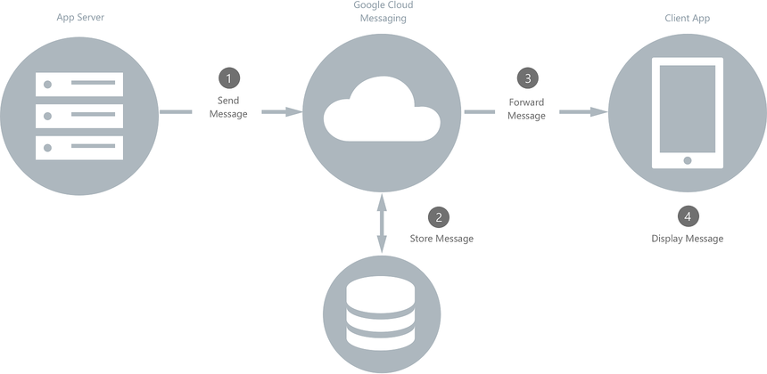
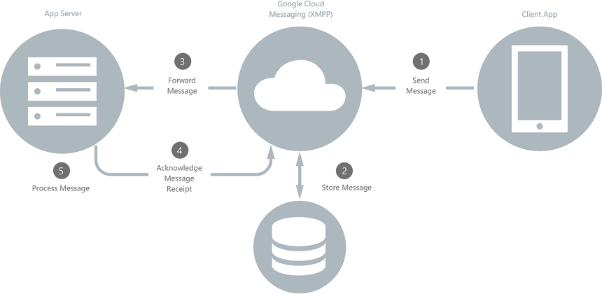

# Firebase Cloud Messaging (FCM) XMPP - PHP  

| Service | Master | Develop
|:--:|:--:|:--:
| CI Status | [](https://travis-ci.com/baudev/Firebase-Cloud-Messaging-FCM-XMPP) | [](https://travis-ci.com/baudev/Firebase-Cloud-Messaging-FCM-XMPP)
| Version |  []() | []()

This PHP program, based on the unmaintained [sourc7/FCMStream](https://github.com/sourc7/FCMStream) repository, allows receiving and sending messages with the XMPP Protocol using [Firebase Cloud Messaging](https://firebase.google.com/docs/cloud-messaging/).  
  
## INSTALLATION  

With Packagist:
```
composer require baudev/fcm-xmpp  
```

## EXAMPLE  
- Create an `index.php` file and write into it one of the two following script ([method1](#1-using-a-class-best-solution) or [method2](#2-using-function-callback-parameters)). Don't forget replacing :  `SENDER_ID`, `SERVER KEY`.
- Run the script: `php index.php`

*Note: examples are provided in the directory `examples`.*

### 1. Using a class (**best solution**):   
```php  
class YOURCLASSNAME extends \FCMStream\Core {  
  
	public function onSend(string $from, string $messageId, Actions $actions) { 
		 // TODO: Implement onSend() method. 
	 }  
 
	public function onReceiveMessage($data, int $timeToLive, string $from, string $messageId, string $packageName, Actions $actions) { 
		// we answer to the message received 
		$message = new \FCMStream\Message();  
		$message->setTo($from);  
		$message->setMessageId("message_id_test");  
		$message->setPriority(\FCMStream\Message::PRIORITY_HIGH);  
		$message->setData(array("test" => "Hello World!")); 
		 
		$actions->sendMessage($message);
	}  

	public function onFail(?string $error, ?string $errorDescription, ?string $from, ?string $messageId, Actions $actions) { 
		// TODO: Implement onFail() method. 
	}  
	 public function onExpire(string $from, string $newFCMId, Actions $actions) { 
		// TODO: Implement onExpire() method. 
	 }
}  
  
$test = new YOURCLASSNAME('SENDER_ID', 'SERVER KEY', 'debugfile.txt', \FCMStream\helpers\Logs::DEBUG);  
$test->stream();  
```

### 2. Using function callback parameters:

```php  
$test = new FCMStream\Callbacks('SENDER_ID', 'SERVER KEY', 'debugfile.txt', \FCMStream\helpers\Logs::ANY);  
  
// onSend callback  
$test->setOnSend(function (string $from, string $messageId, Actions $actions){  
	// TODO: Implement onSend() method.
  });  
  
// onReceiveMessage callback  
$test->setOnReceiveMessage(function ($data, int $timeToLive, string $from, string $messageId, string $packageName, Actions $actions){ 
	// we answer to the message received 
	$message = new \FCMStream\Message();  
	$message->setTo($from);  
	$message->setMessageId("message_id_test");  
	$message->setPriority(\FCMStream\Message::PRIORITY_NORMAL);  
	$message->setData(array("test" => "Hello World!"));  
	
	$actions->sendMessage($message);  
});
  
// onFail callback  
$test->setOnFail(function (?string $error, ?string $errorDescription, ?string $from, ?string $messageId, Actions $actions) { 
	// TODO: Implement onFail() method. 
  });  
  
// onExpire callback  
$test->setOnExpire(function (string $from, string $newFCMId, Actions $actions){  
	// TODO: Implement onExpire() method. 
  });  
$test->stream();  
```  
  
## USAGE  
  
1. **Downstream Messages**: server-to-device through FCM  
  
  
  
2. **Upstream Messages**: device-to-server through FCM  
  
    

## DOCUMENTATION

See the [wiki page](https://github.com/baudev/Firebase-Cloud-Messaging-FCM-XMPP/wiki/Documentation) to discover every possibilities provided by this framework.

### TODO  
  
- [ ] Add more comments
- [X] Add methods for responding easily, to set message priority and so on. *Notification property is not handled yet*  
- [X] Improve README  
  
### CREDITS  
  
- Images in the [USAGE](#usage) part are coming from the [XAMARIN documentation](https://docs.microsoft.com/en-us/xamarin/android/data-cloud/google-messaging/google-cloud-messaging).  
- Major part of the code is coming from the [sourc7/FCMStream](https://github.com/sourc7/FCMStream) repository. As it is unmaintained, I allow myself to fork it and improve it.  
  
### LICENSE  
  
```  
MIT License  
  
Copyright (c) 2016 Ante Radman (Radoid), Irvan Kurniawan (TechRapid), Baudev.  
  
Permission is hereby granted, free of charge, to any person obtaining a copy  
of this software and associated documentation files (the "Software"), to deal  
in the Software without restriction, including without limitation the rights  
to use, copy, modify, merge, publish, distribute, sublicense, and/or sell  
copies of the Software, and to permit persons to whom the Software is  
furnished to do so, subject to the following conditions:  
  
The above copyright notice and this permission notice shall be included in all  
copies or substantial portions of the Software.  
  
THE SOFTWARE IS PROVIDED "AS IS", WITHOUT WARRANTY OF ANY KIND, EXPRESS OR  
IMPLIED, INCLUDING BUT NOT LIMITED TO THE WARRANTIES OF MERCHANTABILITY,  
FITNESS FOR A PARTICULAR PURPOSE AND NONINFRINGEMENT. IN NO EVENT SHALL THE  
AUTHORS OR COPYRIGHT HOLDERS BE LIABLE FOR ANY CLAIM, DAMAGES OR OTHER  
LIABILITY, WHETHER IN AN ACTION OF CONTRACT, TORT OR OTHERWISE, ARISING FROM,  
OUT OF OR IN CONNECTION WITH THE SOFTWARE OR THE USE OR OTHER DEALINGS IN THE  
SOFTWARE.  
```
